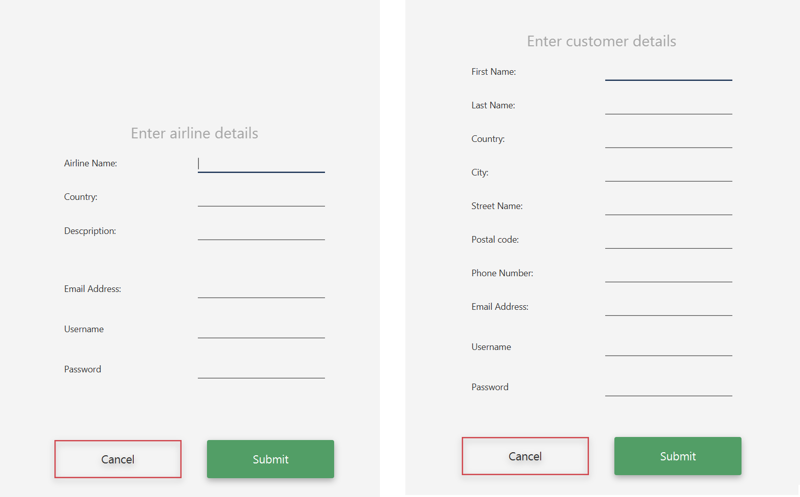

# Flights_App

Aplikacja Flights napisana przy użyciu języku Java i frameworku Spring jako projekt grupowy na studiach. 

Aplikacja służy do obsługi lotów z poziomu lini lotniczych oraz rezerwacji lotów z poziomu klienta.
Krótka dokumentacja przedstawiająca strukture aplikacji. 

<b>1. Model danych</b>

<b>2. Warstwa persystencji i baza danych</b> 

W projekcie korzystamy z bazy danych MySql uruchamianej na lokalnym serwerze. W celu umożliwienia mapowania obiektowo-relacyjnego wykorzystaliśmy Spring Data JPA, bardzo podobny do Hibernate. Spring Data JPA zajmuje się m.in. tworzeniem tabel w bazie danych na podstawie kodu napisanego w Javie Udostępnia również wiele metod poprzez repozytoria zdefiniowane w projekcie (metody takie jak save(), saveAll(), findAll(), delete(), deleteAll()).

<b>3.Autentykacja i autoryzacja</b> 

Autentykacja i autoryzacja są realizowane z wykorzystaniem Spring Security. Główna konfiguracja znajduje się w klasie SecurityConfiguration w katalogu config. Dane użytkowników są przechowywane w bazie danych. Wszystkie hasła przechowywane w bazie danych są zakodowane.

Aplikacja pozwala na rejestrację jako linia lotnicza (airline) albo jako klient (user). Stosownego wyboru dokonuje się po naciśnięciu przycisku Register.

Formularze do rejestracji wymagają wypełnienia wszystkich pól. Sprawdza się dodatkowo czy e-mail ma poprawną formę oraz czy w bazie danych nie istnieje już użytkownik o danej nazwie użytkownika.
Po rejestracji użytkownik zostaje przeniesiony do ekranu głównego i jeśli wprowadził poprawne dane, może się zalogować do aplikacji.

W systemie, dla użytkownika zdefiniowane są 4 role. 

<b>Użytkownik niezalogowany (anonymous)</b> 

Użytkownik niezalogowany może jedynie przeglądać:
<ul>
  <li> polecane loty</li>
 <li>najpopularniejsze kierunki lotów</li>
 <li>listę wszystkich lotów</li>
 <li>listę wszystkich linii lotniczych</li>
</ul>
<b>Użytkownik zalogowany jako klient (user)</b> 

Użytkownik zalogowany ma wszystkie możliwości użytkownika niezalogowanego, ponadto może:
<ul>
<li>Edytować swoje dane użytkownika</li>
<li>Składać rezerwacje na loty</li>
<li>Przeglądać swoje rezerwacje</li>
<li>Edytować i usuwać swoje rezerwacje</li>
  </ul>

<b>Użytkownik zalogowany jako linia lotnicza (airline)</b> 

Użytkownik zalogowany jako linia lotnicza ma wszystkie możliwości użytkownika niezalogowanego, ponadto może:
<ul>
  <li>Przeglądać klientów</li>
<li>Dodawać, edytować i usuwać loty jego linii lotniczej (wraz z kategoriami biletów)</li>
<li>Dodawać, edytować i usuwać zniżki na loty</li>
<li>Przeglądać i usuwać rejestracje złożone na loty jego linii lotniczej</li>
<li>Przeglądać szczegóły lotów, w których mieszczą się również statystyki dotyczące:</li>
  <ul>
<li>Liczby rezerwacji złożonych na lot</li>
<li>Liczby wolnych i zajętych miejsc na lot</li>
<li>Przychodów z rezerwacji na dany lot</li>
  </ul>
</ul>
  
<b>Użytkownik zalogowany jako administrator (admin)</b> 

Użytkownik zalogowany jako administrator może:
<ul>
<li>Przeglądać, edytować i usuwać klientów (usunięcie klienta usuwa również użytkownika z nim powiązanego, zabierając dostęp do aplikacji)</li>
<li>Przeglądać, edytować i usuwać linie lotnicze (usunięcie linii lotniczej usuwa również użytkownika z nim powiązanego, zabierając dostęp do aplikacji)</li>
<li>Przeglądać, dodawać, usuwać i edytować loty i szczegóły lotów, w których mieszczą się również statystyki dotyczące:</li>
  <ul>
<li>Liczby rezerwacji złożonych na lot</li>
<li>Liczby wolnych i zajętych miejsc na lot</li>
<li>Przychodów z rezerwacji na dany lot</li>
  </ul>
<li>Przeglądać, usuwać i edytować rezerwacje wszystkich </li>
  
  </ul>

<b>4. Screeny z aplikacji</b> 

<b>5. Uruchamianie projektu</b>

Do uruchomienia i korzystania z aplikacji niezbędna jest baza danych MySql stworzona według instrukcji i uruchomiona lokalnie.
Aby stworzyć lokalną bazę danych potrzebną do uruchomienia projektu, należy:
<ol>
  <li>Pobrać i zainstalować MySql</li>
<li>Uruchomić lokalny serwer bazy danych na porcie 3306</li>
<li>Zalogować się do MySql z linii poleceń komendą:</li>
  <ul>
<li>mysql -u [username] -p</li>
    <ul>
<li>Gdzie [username] to nazwa użytkownika root lokalnego serwera MySql</li>
<li>Hasło o które system poprosi, jest hasłem przypisanym do tego konta</li>
  </ul>
  </ul>
<li>Utworzyć bazę danych ciągiem poleceń:</li>
  <ul>
<li>create database yourflights;</li>
<li>create user ‘yourFlightsUser’@’%’ identified by ‘123’;</li>
<li>grant all on yourflights.* to ‘yourFlightsUser’@’%’;</li>
  </ul>
<li>Wgrać do bazy danych plik yourflights.sql znajdujący się w katalogu głównym projektu. Wchodzimy do katalogu głównego projektu i wykonujemy komendę:</li>
    <ul>
<li>Mysql -u [username] -p yourflights < yourflights.sql</li>
<li>Gdzie [username] to nazwa konta root lokalnego serwera MySql</li>
<li>Hasło o które system poprosi, jest hasłem przypisanym do tego konta</li>
    </ul>
                                                    </ol>                                                    
                                                   
  <b>5.Uruchomienie aplikacji:</b> 

Sposób 1 - Gradle

Przechodzimy do katalogu projektu
Uruchamiamy komendę “gradle run”

Sposób 2 - jar

Projekt uruchamiamy przez uruchomienie pliku yourflights-3.0.0-m3.jar znajdującego się w katalogu głównym projektu.
Przechodzimy do katalogu głównego projektu
Wywołujemy komendę “java -jar yourflights-3.0.0-m3.jar”
